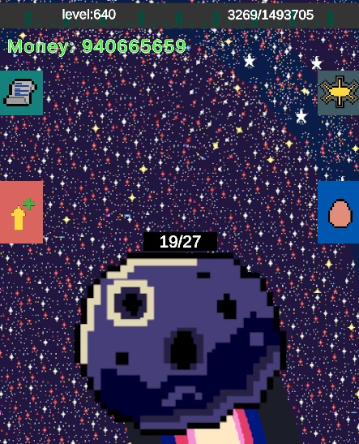
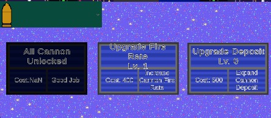
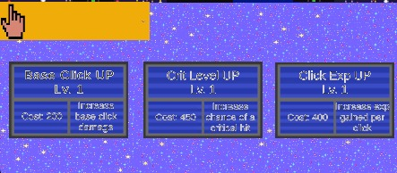
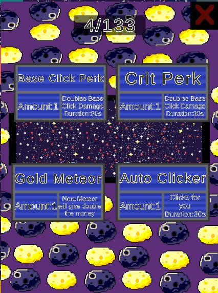
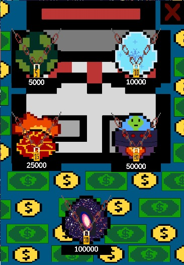
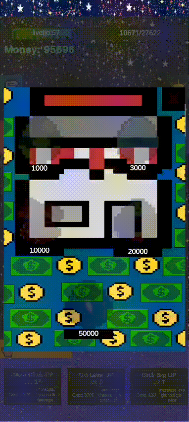
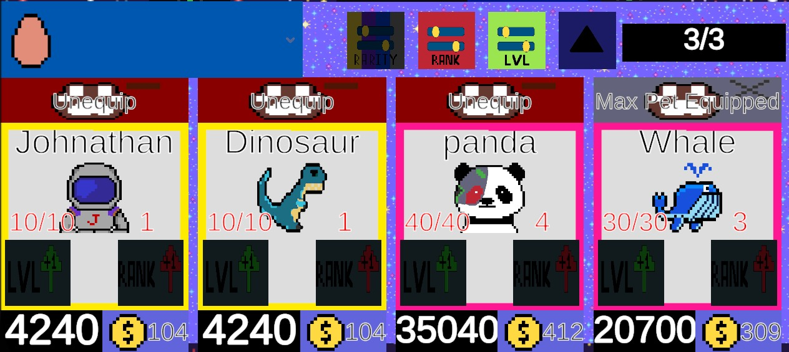
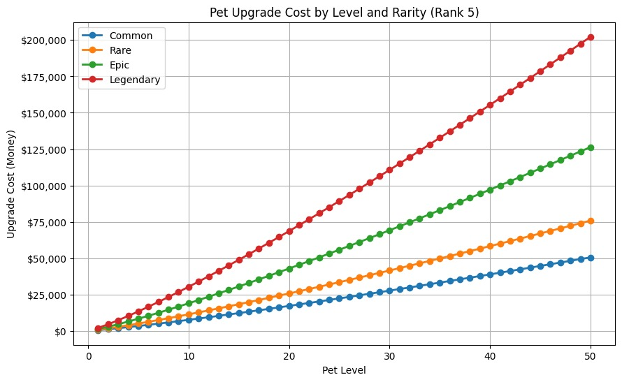
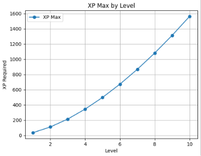

------------------
**Space Clicker**
-----------------


# Game Description and of its mechanics

*Space Clicker is an android clicker game made with Unity where the player have to destroy falling meteors by tapping on them.Each meteor destroyed rewards the player with money that can be used to buy upgrade and progress faster. The game include a gacha mechanic where you can use your earned moneys to pull for unique pets.*


**Experience**
*Space Clicker features a level up system where each tap give 10 experience points*




# Permanent Upgrades


* **Cannon Upgrades:** *You have to unlock at least one of the two cannons first*

* **Fire Rate UP:** *reduces time between shots (maximum level is set to 25)*

* **Cannon Depot UP:** *+10 capacity to fuel deposit (maximum level is set to 50)*





* **Crit Chance UP:** *gives +1% chance of dealing a critical hit (x2 damage) (maximum level is set to 50)*

* **Experience UP:** *gives +10 experience for each click (maximum level is set to 75)*

* **Base Click UP:** *gives +1 damage for each click (maximum level is set to 75)*




# Temporary perks

* **Golden Meteor:** next meteor will give double the money on destruction

* **Alien exploitation(autoclicker)**: for 30 second activate an autoclicker at the rate of 10 clicks per second

* **Starry touch(Crit Damage Perk):** *for the next 30 seconds critical hits will deal x3 damage*  

* **Intergalactic rage(Base Click Perk):** *for the next 30 seconds doubles damage dealt to the meteor*





# EGG AND PET RARITY

### Pets are also a fundamental game mechanic.You can get them by opening different eggs, each of the 5 available eggs have different costs and pull rates.

Pet rarities:

* Common
* Rare
* Epic 
* Leggendary


*There are many different pets going from the funniest to the most majestic. Each pet gives different boosts depending on its rarity,level and rank,they boost critical rate and give a money multiplier.*

*You can buy eggs from the shop section.*




| Egg1 | Egg 2 | Egg 3 | Egg 4 | Egg 5  |
|:---------|:------:|:------:|:------:|-------:|
| Common: 80%    |Common: 65%    |Common: 45%    | Common: 25% | Common: 0%|
| Rare:15%    | Rare: 25%    | Rare: 35%    |Rare:  45%    |Rare:  50%     |
| Epic: 5%     |Epic:  9%     |Epic:  17%    |Epic:  25%    |Epic:  30%     |
| Leggendary:0%     |Leggendary: 1%     |Leggendary: 3%     |Leggendary: 5%     |Leggendary: 20%     |
|Cost: 5.000  |Cost: 10.000 | Cost: 25.000 |Cost:  50.000 |Cost:  100.000 |


-------------------------------------------------------------------------------------------------------------------


 | Common | Rare | Epic | Legendary |
 |:--------|:------:|:-------:|------------:|
 | Axolotl | Bear | Crocodile | Dinosaur |
 | Capybara | Fox | Hog | Dragon |
 | Cat | Owl | Panda | Johnathan |
 | Crow | Shark | Werewolf |  |
 | Dog | Sheep | Whale |  |
 | Eagle | Snake |  |  |
 | Goat | Squid |  |  |
 | Goldfish | Wolf | |  |
 | Racoon |  |  |  |
 | Turtle |  | |  |


*after a short animation showing what you got your pet*




 *will be added to the pets inventory that is accessible through a dropdown menu where you can equip your pet for a maximum of three pet at once*
 
 

 upgrade your pet and rank them up,at first your pet will reach his maximum power at level 10 but if you level two pet of the same type to their max level you can then merge them up creating a new pet of a hightier rank with a new,bigger,level cap.*
 

| Level | Common | Rare   | Epic   | Legendary |
|:-----|:------:|:------:|:------:|---------:|
|   1  | $100   | $150   | $250   | $400      |
|   2  | $230   | $340   | $570   | $910      |
|   3   | $370   | $550   | $910   | $1,460    |
|   4   | $510   | $770   | $1,280 | $2,050    |
|   5   | $670   | $1,000 | $1,670 | $2,670    |
|   6   | $830   | $1,240 | $2,070 | $3,310    |
|   7   | $990   | $1,490 | $2,480 | $3,970    |
|   8   | $1,160 | $1,740 | $2,910 | $4,650    |
|   9   | $1,340 | $2,000 | $3,340 | $5,350    |
|   1  | $1,510 | $2,270 | $3,780 | $6,050    |


# Now a bit of maths


## pet upgrade cost

```csharp
public int UpgradeCost(PetInstance pet)
{
    if (pet == null)
    {
        return 0;
    }

    int rarityValue = getRarity(pet);

    float rarityMult = 1f + rarityValue * 0.60f;
    float rankMult = 1f + (Mathf.Max(1, pet.rank) - 1) * 0.35f;
    float lvlGrowth = Mathf.Pow(Mathf.Max(1, pet.Petlvl), 1.18f);

    petData petData = GetPetData(pet);

    float baseCost = 100f;

    finalCost = Mathf.RoundToInt(
        baseCost * rarityMult * rankMult * lvlGrowth / 10f
    ) * 10;

    pet.currentUPcost = finalCost;

    return finalCost;
}
```
*upgrade cost start from 100 coins and increase by 60% for each rarity (common doesn't increase base cost) than another 35% for every rank going from 1 to 5 lastly current pet level also is used to calc next level cost,this cost is rounded to the nearest 10 multiple*




--------------------------------------------------------------------------------------

## Level up experience scaling

```csharp
if (data.xp >= data.xpMax)
{
    data.xp -= data.xpMax;
    data.lvl += 1;
    lvlup = true;

    Unlock();

    data.xpMax = Mathf.RoundToInt(35f * Mathf.Pow(data.lvl, 1.65f));

    StartCoroutine(LevelUpAnimation());
}
```

*required experience scales with player level to 1,65(value found with various balancing tests)multiplied with a coefficient of 35 also obtained by testing,allat rounded to the nearest int*