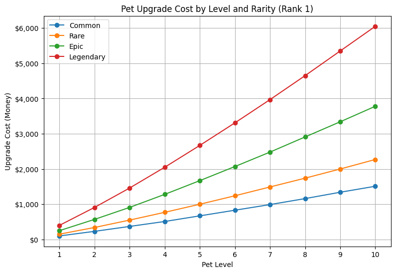

---
**Space Clicker**
---

# Game Description and of its mechanics

*Space Clicker is an android clicker game made with unity where the player have to destroy falling meteors by tapping on them.Each meteor destroyed rewards the player with money that can be used to buy upgrade and progress faster. The game include a gacha mechanic where you can use your earned moneys to pull for unique pets.*

**Experience**
*Space Clicker features a level up system where each tap give 10 experience point*

# Permanent Upgrades

* **Cannon Upgrades:** *You have to unlock at least one of the two cannons first*

* **Fire Rate UP:** *reduces time between shots (maximum level is set to 25)*

* **Base Click UP:** *gives +1 damage for each click (maximum level is set to 75)*

* **Crit Chance UP:** *gives +1% chance of dealing a critical hit (x2 damage) (maximum level is set to 50)*

* **Experience UP:** *gives +10 experience for each click (maximum level is set to 75)*

* **Cannon Depot UP:** *+10 capacity to fuel deposit (maximum level is set to 50)*

# Temporary perk

* **Golden Meteor:** next meteor will give double the money on destruction

* **Alien exploitation(autoclicker)**: for 30 second activate an autoclicker at the ratio of 10 clicks per second

* **starry touch(Crit Damage Perk):** *for the next 30 seconds critacal hits will deal x3 damage*  

* **rabbia intergalattica(Base Click Perk):** *for the next 30 seconds doubles damage dealth to the meteor*

# EGG AND PET RARITY

### pet are also a foundamental game mechanic,you can get them by opening different eggs,each of the 5 avaible egg have different cost and pull rates.

pet rarities:

* Common
* Rare
* Epic 
* Leggendary

*there are many different pets going from the funniest to the most majestic.Each pet give different boost depending on it's rarity,level and rank,they boost critical rate and give a money multiplier.You can buy eggs from the shop section,after a short animation showing what you got your pet will be added to the pet inventory that is accessable through a dropdown menu where you can equip your pet for a maximum of three pet at once,upgrade your pet and rank them up,at first your pet will reach his maximum power at level 10 but if you level tw opet of the same type to their max level you can then merge them up creating a new pet of a hightier rank with a new,bigger,level cap.*

 //Dovresti includere uno screenshot, una descrizione/nome/istruzioni per l'uso e una clausola di esclusione di responsabilit√ sull'utilizzo 
 //dell'IA in fondo alla pagina, specificando in che modo l'hai utilizzata.